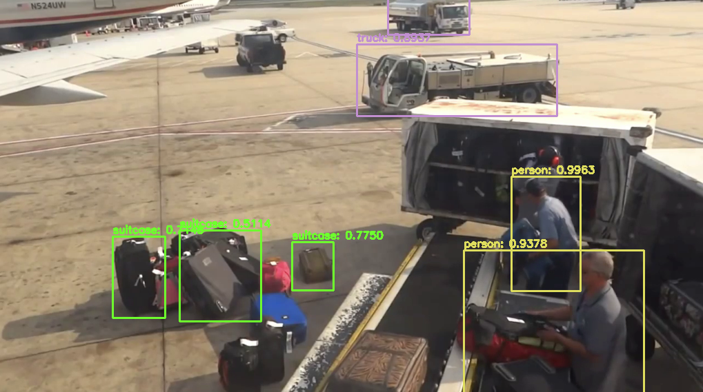

# object-detection-with-deep-learning

	Este código tem como objetivo utilizar deep learning para detectar objetos em um vídeo.
	Para o funcionamento do código apenas o OpenCV deve ser baixado utilizando o seguinte comando: ``pip3 install opencv-python``

#### Instruções para execução

1. Baixar os pesos no seguinte link https://drive.google.com/drive/folders/1Azu1YfGZqd9CSty0xEZpur7ohBt4fjsB?usp=sharing e colocar na pasta ``yolo-coco`` dentro do projeto
2. Para executar a detecção: ``python3 yolo_object_detection.py``

#### Alguns Pontos Sobre o Código
 
 O algoritmo de detecção de objetos utiliza um dataset pretreinado COCO e YOLO como detector de objetos. O YOLO foi escolhido pois apesar de ser menos acurado ele é mais rápido já que utiliza uma estratégia de detectar em um estágio, além de que estamos tentando detectar objetos em vídeos aqui então velocidade no processamento seria o ideal.

 Infelizmente não consegui obter resultados muito significativos com o algoritmo para funcionar em tempo real, pois cada frame está levando de 2 a 4 segundos para ser processado (meu computador não possui uma GPU).

#### Saída

 Exemplo de Resultado do processamento:
 
 